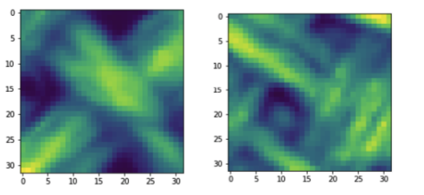
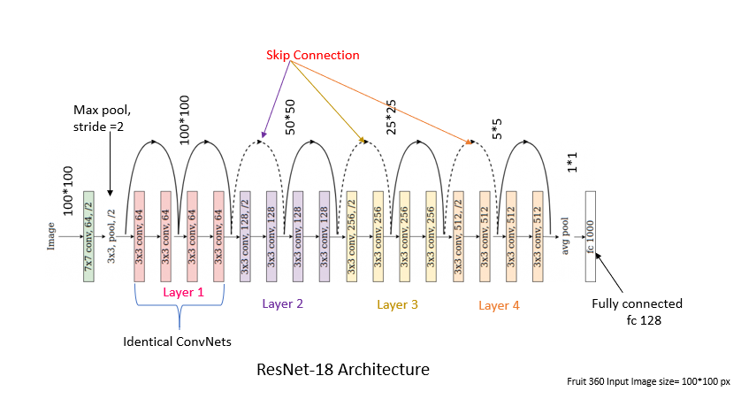

# textile-defect-detection
In the context of textile fabric, rare anomaly can occurs, hence compromizing the quality of the tissues. In order to avoid that in some scenario, it is crucial to detect the defect.

## Overview and Goal

Fabric defect detection is a significant phase of quality control in textile industry. Manual defect inspection lacks the accuracy and the labor cost is high. So the goal of this project is to develop a system to detect defects in fabrics with Image Processing techniques and Neural Networks.

## Dataset Desciption 

The dataset is 4 GB and has 48000 distinct records. The size of the images in the dataset is either 32x32 or 64x64. The data includes records that belong 6 different classes of defects - 
* good - If the fabric is good and has no defect
* color - There is a defect in the color of the fabric 
* cut - There is a cut in the fabric
* hole - There is a hole in the fabric
* thread - There is some thread coming off
* metal contamination - Fabric has some metal contamination



The dataset inlcudes images the original images and images created after rotations. The data for 8 different rotations in - 0, 20, 40, 60, 80, 100, 120, 140 is included.Given an image size, a train and test dataset are available with randomly generated patches. Source images from the train and test are non-overlapping

## Model Architectures
We tried to train models with three different architectures. 

* CNN
* ResNet18
* ResNet34



## Transformations

```
transforms.Compose([
transforms.ToTensor(), transforms.Normalize([0.3541], [0.1352]), transforms.RandomErasing(0.3, value=0)
])

```

## Results

| Models    | Accuracy | Train Loss | Validation Loss |
|-----------|----------|------------|-----------------|
| CNN       |    0.82      |   1.303         |    1.333             |
| ResNet18  |      0.98    |    1.286        |    26.913             |
| ResNet34  |    0.95      |    1.333        |     21.588            |


## Future Works

* PREPROCESSING STEPS: Add more preprocessing steps like rotating at angles other than in dataset
* DIFFERENT MODELS : Try more complex neural network models like VQVAE
* ADD MORE DATA : Try to get more data to train the models better

### Model Summaries

**ResNet18**
```
Classification Task: Keepíng all the data
----------------------------------------------------------------
        Layer (type)               Output Shape         Param #
================================================================
            Conv2d-1            [1, 64, 16, 16]           3,136
       BatchNorm2d-2            [1, 64, 16, 16]             128
              ReLU-3            [1, 64, 16, 16]               0
         MaxPool2d-4              [1, 64, 8, 8]               0
        Conv2dAuto-5              [1, 64, 8, 8]          36,864
       BatchNorm2d-6              [1, 64, 8, 8]             128
              ReLU-7              [1, 64, 8, 8]               0
        Conv2dAuto-8              [1, 64, 8, 8]          36,864
       BatchNorm2d-9              [1, 64, 8, 8]             128
 ResNetBasicBlock-10              [1, 64, 8, 8]               0
       Conv2dAuto-11              [1, 64, 8, 8]          36,864
      BatchNorm2d-12              [1, 64, 8, 8]             128
             ReLU-13              [1, 64, 8, 8]               0
       Conv2dAuto-14              [1, 64, 8, 8]          36,864
      BatchNorm2d-15              [1, 64, 8, 8]             128
 ResNetBasicBlock-16              [1, 64, 8, 8]               0
      ResNetLayer-17              [1, 64, 8, 8]               0
           Conv2d-18             [1, 128, 4, 4]           8,192
      BatchNorm2d-19             [1, 128, 4, 4]             256
       Conv2dAuto-20             [1, 128, 4, 4]          73,728
      BatchNorm2d-21             [1, 128, 4, 4]             256
             ReLU-22             [1, 128, 4, 4]               0
       Conv2dAuto-23             [1, 128, 4, 4]         147,456
      BatchNorm2d-24             [1, 128, 4, 4]             256
 ResNetBasicBlock-25             [1, 128, 4, 4]               0
       Conv2dAuto-26             [1, 128, 4, 4]         147,456
      BatchNorm2d-27             [1, 128, 4, 4]             256
             ReLU-28             [1, 128, 4, 4]               0
       Conv2dAuto-29             [1, 128, 4, 4]         147,456
      BatchNorm2d-30             [1, 128, 4, 4]             256
 ResNetBasicBlock-31             [1, 128, 4, 4]               0
      ResNetLayer-32             [1, 128, 4, 4]               0
           Conv2d-33             [1, 256, 2, 2]          32,768
      BatchNorm2d-34             [1, 256, 2, 2]             512
       Conv2dAuto-35             [1, 256, 2, 2]         294,912
      BatchNorm2d-36             [1, 256, 2, 2]             512
             ReLU-37             [1, 256, 2, 2]               0
       Conv2dAuto-38             [1, 256, 2, 2]         589,824
      BatchNorm2d-39             [1, 256, 2, 2]             512
 ResNetBasicBlock-40             [1, 256, 2, 2]               0
       Conv2dAuto-41             [1, 256, 2, 2]         589,824
      BatchNorm2d-42             [1, 256, 2, 2]             512
             ReLU-43             [1, 256, 2, 2]               0
       Conv2dAuto-44             [1, 256, 2, 2]         589,824
      BatchNorm2d-45             [1, 256, 2, 2]             512
 ResNetBasicBlock-46             [1, 256, 2, 2]               0
      ResNetLayer-47             [1, 256, 2, 2]               0
           Conv2d-48             [1, 512, 1, 1]         131,072
      BatchNorm2d-49             [1, 512, 1, 1]           1,024
       Conv2dAuto-50             [1, 512, 1, 1]       1,179,648
      BatchNorm2d-51             [1, 512, 1, 1]           1,024
             ReLU-52             [1, 512, 1, 1]               0
       Conv2dAuto-53             [1, 512, 1, 1]       2,359,296
      BatchNorm2d-54             [1, 512, 1, 1]           1,024
 ResNetBasicBlock-55             [1, 512, 1, 1]               0
       Conv2dAuto-56             [1, 512, 1, 1]       2,359,296
      BatchNorm2d-57             [1, 512, 1, 1]           1,024
             ReLU-58             [1, 512, 1, 1]               0
       Conv2dAuto-59             [1, 512, 1, 1]       2,359,296
      BatchNorm2d-60             [1, 512, 1, 1]           1,024
 ResNetBasicBlock-61             [1, 512, 1, 1]               0
      ResNetLayer-62             [1, 512, 1, 1]               0
    ResNetEncoder-63             [1, 512, 1, 1]               0
AdaptiveAvgPool2d-64             [1, 512, 1, 1]               0
           Linear-65                     [1, 6]           3,078
    ResnetDecoder-66                     [1, 6]               0
================================================================
Total params: 11,173,318
Trainable params: 11,173,318
Non-trainable params: 0
----------------------------------------------------------------
Input size (MB): 0.00
Forward/backward pass size (MB): 1.23
Params size (MB): 42.62
Estimated Total Size (MB): 43.86
----------------------------------------------------------------
Total_params 11173318
Trainable_params 11173318
```

**CNN**
```
----------------------------------------------------------------
        Layer (type)               Output Shape         Param #
================================================================
            Conv2d-1            [1, 32, 30, 30]             320
       BatchNorm2d-2            [1, 32, 30, 30]              64
              ReLU-3            [1, 32, 30, 30]               0
         AvgPool2d-4            [1, 32, 15, 15]               0
            Conv2d-5            [1, 64, 13, 13]          18,496
       BatchNorm2d-6            [1, 64, 13, 13]             128
              ReLU-7            [1, 64, 13, 13]               0
         AvgPool2d-8              [1, 64, 6, 6]               0
            Conv2d-9              [1, 32, 6, 6]           2,080
AdaptiveAvgPool2d-10              [1, 32, 1, 1]               0
           Linear-11                     [1, 6]             198
================================================================
Total params: 21,286
Trainable params: 21,286
Non-trainable params: 0
----------------------------------------------------------------
Input size (MB): 0.00
Forward/backward pass size (MB): 0.99
Params size (MB): 0.08
Estimated Total Size (MB): 1.07
----------------------------------------------------------------
Total_params 21286
Trainable_params 21286
```

Contributors: Emre Okcular, Hashneet Kaur
